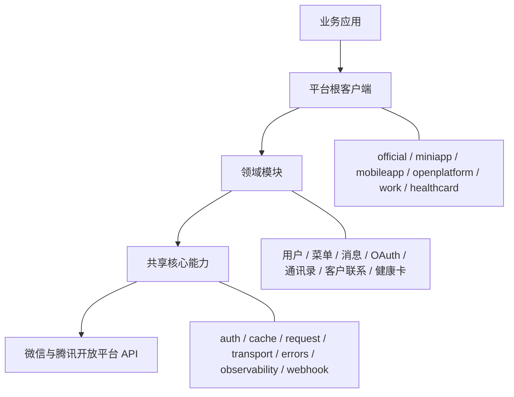
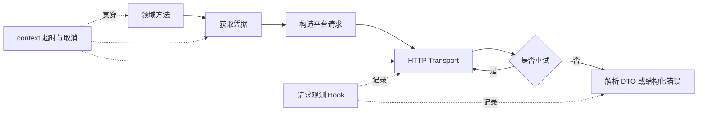

# SDK Wiki Architecture Guide Implementation Plan

> **For agentic workers:** REQUIRED SUB-SKILL: Use superpowers:subagent-driven-development (recommended) or superpowers:executing-plans to implement this plan task-by-task. Steps use checkbox (`- [ ]`) syntax for tracking.

**Goal:** Extend the SDK user guide with a clear capability overview, user-facing architecture model, and end-to-end API request lifecycle.

**Architecture:** Add three introductory sections before the existing getting-started guide. Use tables for default behavior and extension decisions, and GitHub-compatible Mermaid flowcharts for the SDK layers and request lifecycle. Keep the main repository guide and the independent GitHub Wiki repository byte-for-byte identical.

**Tech Stack:** Markdown, GitHub Wiki, Mermaid flowchart syntax, Git

---

### Task 1: Add the capability and architecture introduction

**Files:**
- Modify: `wiki/Home.md:1-28`

- [ ] **Step 1: Extend the table of contents**

Insert these links before “开始使用”:

```markdown
- [SDK 能力概览](#sdk-能力概览)
- [整体架构](#整体架构)
- [请求执行链路](#请求执行链路)
```

- [ ] **Step 2: Add the SDK capability overview**

Insert the following section before “开始使用”:

```markdown
## SDK 能力概览

`wx` 将不同平台的身份配置和业务 API 保留在各自的平台包中，同时复用一致的请求、凭据、
错误、观测和回调基础设施。业务代码只需要创建目标平台客户端，再从客户端进入对应领域模块。

| 能力 | SDK 默认行为 | 使用者需要关注 |
| --- | --- | --- |
| 多平台接入 | 六个平台使用独立根客户端和类型化领域 API | 只引入目标平台包并配置该平台身份 |
| Context | 所有网络方法接收 `context.Context` | 在业务入口设置超时并沿调用链传递 |
| 凭据管理 | 自动获取、缓存、提前刷新并协调并发刷新 | 多实例部署时注入共享缓存或外部 Provider |
| HTTP 与重试 | 统一编码请求、发送、读取响应并按策略重试 | 按运行环境注入 HTTP Client、代理或重试策略 |
| 错误处理 | 返回支持 `errors.Is` 和 `errors.As` 的结构化错误 | 区分平台错误、网络错误和 context 错误 |
| 请求观测 | 通过 Hook 暴露操作名、耗时、状态和 request ID | 将事件接入日志、指标或链路追踪 |
| 回调处理 | 完成 URL 验证、签名校验、解密、事件解析和响应封装 | 业务 handler 只处理类型化事件 |
| 测试支持 | 允许替换 HTTP Client、Base URL、缓存和凭据 | 使用本地服务和固定依赖测试业务逻辑 |
```

- [ ] **Step 3: Add the user-facing architecture section**

Insert this section after the capability overview:

````markdown
## 整体架构

SDK 采用“平台根客户端、领域模块、共享核心能力”的分层结构。平台根客户端是业务代码的稳定入口，
负责保存平台配置、认证策略和共享依赖；领域模块按业务语义组织类型化 API；共享核心能力处理各平台
都需要的基础设施。



- **平台根客户端**：保存平台身份、HTTP Client、缓存、重试策略和观测 Hook，并为领域模块共享这些依赖。
- **领域模块**：提供用户、菜单、消息、OAuth、通讯录等类型化方法，调用方不需要拼接 URL 或自行解析响应。
- **共享核心能力**：位于 `core/*`，由平台客户端统一组装。只有定制缓存、传输、凭据、观测或回调行为时，
  使用者才需要直接实现这些接口。

平台包之间彼此独立。选择一个平台不会把其他平台的配置和业务模型带入当前客户端。
````

- [ ] **Step 4: Add the API request lifecycle**

Insert this section after the architecture section:

````markdown
## 请求执行链路

一次出站 API 调用从领域方法开始，经过凭据管理和统一 Transport，最终返回类型化结果或结构化错误：



1. 领域方法校验业务参数并构造平台请求。
2. 凭据管理器读取缓存；凭据缺失或即将过期时协调刷新。
3. Transport 编码请求，使用传入的 `context.Context` 和 HTTP Client 发送。
4. 重试策略根据请求方法、请求重试模式、网络错误或 HTTP 状态决定是否再次尝试。
5. 成功响应解码到结果 DTO；HTTP 或平台业务错误转换为 `*core/errors.Error`。
6. 请求观测 Hook 记录操作名、耗时、状态和 request ID，context 取消会终止刷新、发送和等待重试。

`NewClient` 只校验配置和组装依赖，不会访问网络。首次业务调用可能触发凭据请求，因此客户端构造成功
不代表远端身份和权限已经验证。
````

- [ ] **Step 5: Validate the main guide**

Run:

```bash
git diff --check -- wiki/Home.md
python3 - <<'PY'
from pathlib import Path

text = Path("wiki/Home.md").read_text()
required = [
    "## SDK 能力概览",
    "## 整体架构",
    "## 请求执行链路",
    "flowchart TB",
    "flowchart LR",
]
missing = [item for item in required if item not in text]
if missing:
    raise SystemExit(f"missing sections: {missing}")
print("wiki architecture sections: ok")
PY
```

Expected output:

```text
wiki architecture sections: ok
```

### Task 2: Synchronize the independent GitHub Wiki repository

**Files:**
- Modify: `../wx.wiki/Home.md`

- [ ] **Step 1: Copy the verified guide**

Run:

```bash
cp wiki/Home.md ../wx.wiki/Home.md
```

- [ ] **Step 2: Verify byte-for-byte equality and Markdown whitespace**

Run:

```bash
cmp -s wiki/Home.md ../wx.wiki/Home.md
git -C ../wx.wiki diff --check
```

Expected: both commands exit successfully with no output.

- [ ] **Step 3: Commit the Wiki repository update**

Run:

```bash
git -C ../wx.wiki add Home.md
git -C ../wx.wiki commit -m "docs: explain SDK capabilities and architecture"
```

Expected: one commit changing only `Home.md`.

### Task 3: Verify and commit the main repository documentation

**Files:**
- Modify: `wiki/Home.md`

- [ ] **Step 1: Confirm only intended documentation changes remain**

Run:

```bash
git status --short
git diff --stat
git diff --check
```

Expected: `wiki/Home.md` is the only implementation file changed; planning artifacts may already be committed.

- [ ] **Step 2: Verify links to documented packages resolve locally**

Run:

```bash
for path in core/auth core/cache core/errors core/observability core/request core/transport core/webhook; do
    test -d "$path" || exit 1
done
echo "documented core packages: ok"
```

Expected output:

```text
documented core packages: ok
```

- [ ] **Step 3: Commit the main repository guide**

Run:

```bash
git add wiki/Home.md
git commit -m "docs: explain SDK capabilities and architecture"
```

Expected: one commit changing only `wiki/Home.md`.

- [ ] **Step 4: Report publication status**

Run:

```bash
git status --short --branch
git -C ../wx.wiki status --short --branch
```

Expected: both repositories are clean. If either branch is ahead of its remote, report the exact push command rather than claiming the content is published.
