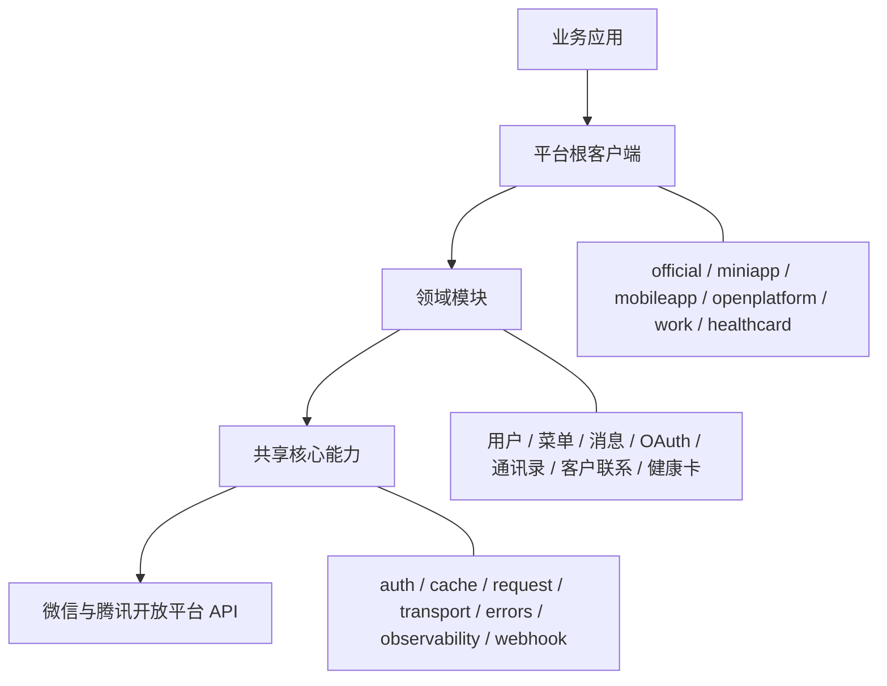
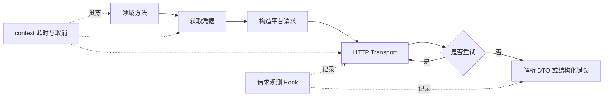

# SDK Wiki 基础能力与架构说明设计

## 目标

扩充 SDK 使用手册的开篇内容，让首次接触项目的使用者在阅读各平台示例之前，能够回答以下问题：

- SDK 覆盖哪些平台和通用场景。
- 平台根客户端、领域模块和共享核心能力如何协作。
- 一次 API 调用经过哪些步骤。
- 哪些能力由 SDK 默认提供，哪些依赖可以由业务方注入。
- 使用者应该从哪里开始，以及何时需要阅读各核心能力的详细章节。

文档主要面向 SDK 使用者，不展开贡献者所需的内部实现、包依赖约束和历史迁移过程。

## 信息结构

在现有“开始使用”之前增加三个章节，并同步调整目录：

1. **SDK 能力概览**
   - 用表格说明平台接入、统一请求、凭据管理、可靠性、错误处理、可观测性、回调和可测试性。
   - 明确默认行为和可注入扩展点，帮助使用者判断需要配置哪些依赖。
2. **整体架构**
   - 说明业务应用、平台根客户端、领域模块、共享核心能力和远端平台之间的关系。
   - 使用 Mermaid 分层图展示职责和依赖方向。
3. **请求执行链路**
   - 展示领域方法、凭据获取、请求发送、重试判断、响应解析的顺序。
   - 说明 `context.Context`、观测 hook、request ID 和错误链贯穿调用过程。

后续已有的“开始使用”“选择平台客户端”和各平台接入章节保持用户操作顺序。公共能力的详细章节继续保留，并由新章节链接过去。

## 能力概览

能力表采用“能力、SDK 行为、使用者关注点”三列：

| 能力 | SDK 行为 | 使用者关注点 |
| --- | --- | --- |
| 多平台接入 | 六个平台使用独立根客户端和领域 API | 只引入目标平台包 |
| Context | 所有网络方法接收 `context.Context` | 在业务入口设置超时并向下传递 |
| 凭据管理 | 自动获取、缓存、提前刷新并协调并发刷新 | 多实例部署时注入共享缓存或外部 Provider |
| HTTP 与重试 | 统一编码、发送、读取响应并按策略重试 | 注入 HTTP Client、代理或 RetryPolicy |
| 错误处理 | 返回支持 `errors.Is` 和 `errors.As` 的结构化错误 | 区分平台错误、网络错误和 context 错误 |
| 请求观测 | 在请求完成后提供操作名、耗时、状态和 request ID | 接入日志、指标或链路追踪 |
| 回调处理 | 完成校验、解密、事件解析和响应封装 | 业务 handler 只处理类型化事件 |
| 测试 | 支持替换 HTTP Client、Base URL、缓存和凭据 | 使用本地服务或固定依赖测试业务代码 |

## 架构图

分层图使用以下结构：

正文解释每一层对使用者的意义：

- 平台根客户端保存平台配置、认证策略和共享依赖，是业务代码的稳定入口。
- 领域模块按业务语义组织类型化 API，避免使用者拼接 URL 或自行解析响应。
- `core/*` 提供跨平台一致的基础设施，通过平台客户端间接使用；只有定制缓存、传输、观测或回调行为时才需要直接接触这些接口。

## 请求链路图

链路说明强调：

- 构造客户端不发起网络请求，首次业务调用才可能获取凭据。
- 缓存命中时直接复用有效凭据；失效时由凭据管理器协调刷新。
- 重试由方法、错误类型和策略共同决定，不能假设所有请求都会重试。
- 平台错误解析后仍保留 HTTP 状态、操作名、平台错误码、request ID 和底层原因。

## 写作原则

- 从使用者需要做的决策出发，避免把包目录逐项复述成参考手册。
- 每个基础能力先说明默认行为，再说明需要定制的场景和入口。
- 架构章节只解释稳定的公开抽象，不描述内部未导出类型。
- 示例沿用当前公开 API，不讨论旧版本或重构过程。
- Mermaid 图控制在 GitHub Wiki 可直接渲染的语法范围内。

## 变更范围

- 更新主仓库 `wiki/Home.md`。
- 将相同内容同步到独立 Wiki 仓库的 `Home.md`。
- 不修改 SDK API、包结构、README 或迁移文档。

## 验证

- 检查两份 `Home.md` 内容完全一致。
- 检查目录锚点与新增章节标题匹配。
- 检查 Mermaid 语法只使用 GitHub 支持的基础 flowchart 节点和连线。
- 检查文档中的包名、选项名和公开方法与当前源码一致。
- 运行 `git diff --check`，避免空白和 Markdown 格式问题。
