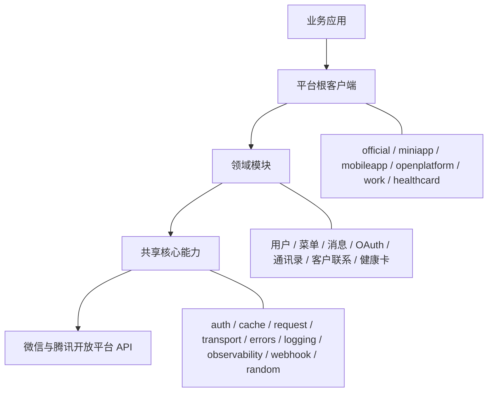
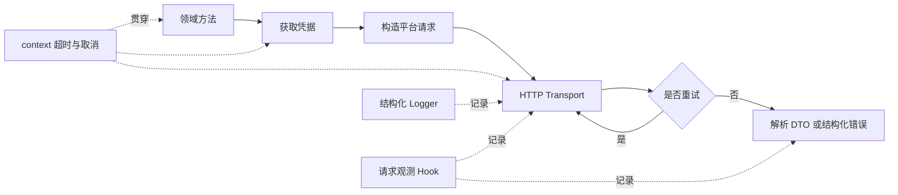

# 微信公众账号SDK使用手册

本手册涵盖微信公众账号SDK的安装与初始化、平台能力接入、凭据管理、错误处理、回调处理及测试实践，
帮助你在 Go 服务端项目中快速、可靠地接入微信生态能力。

## 目录

- [核心能力](#核心能力)
- [整体架构](#整体架构)
- [请求执行链路](#请求执行链路)
- [开始使用](#开始使用)
- [选择平台客户端](#选择平台客户端)
- [微信公众号](#微信公众号)
- [微信小程序](#微信小程序)
- [微信移动应用](#微信移动应用)
- [微信开放平台](#微信开放平台)
- [企业微信](#企业微信)
- [腾讯电子健康卡](#腾讯电子健康卡)
- [Context 与超时](#context-与超时)
- [HTTP 客户端与代理](#http-客户端与代理)
- [凭据与缓存](#凭据与缓存)
- [重试策略](#重试策略)
- [错误处理](#错误处理)
- [日志与请求观测](#日志与请求观测)
- [回调处理](#回调处理)
- [文件与二进制响应](#文件与二进制响应)
- [测试](#测试)
- [生产环境建议](#生产环境建议)
- [常见问题](#常见问题)
- [API 索引](#api-索引)

## 核心能力

`wx` 的核心能力通过平台客户端统一组装。一般业务代码不需要直接创建 `core/transport.Client`
或 `core/auth.Manager`，只需要在构造公众号、小程序、企业微信等平台客户端时注入需要的能力。

### 默认配置能做什么

只提供平台 `Config` 就可以调用 API：

```go
client, err := official.NewClient(official.Config{
	AppID:     appID,
	AppSecret: appSecret,
})
if err != nil {
	return err
}

ctx, cancel := context.WithTimeout(context.Background(), 3*time.Second)
defer cancel()

profile, err := client.Users().Info(ctx, openID)
```

这个客户端已经包含以下基础能力：

- 使用超时为 30 秒的默认 HTTP Client。
- 使用进程内存缓存保存服务端凭据。
- 在首次需要时获取凭据，在过期前自动刷新，并合并同一进程内的并发刷新。
- 将 HTTP 错误和平台业务错误转换为结构化错误。
- 将调用结果解码到对应平台的响应类型。
- 默认只尝试一次请求，不输出日志，也不依赖任何日志框架。

单实例服务、命令行工具和本地开发可以从默认配置开始。多实例服务通常需要注入共享缓存；
有统一网络出口、可靠性或监控要求时，再注入 HTTP Client、重试策略和观测 Hook。

### 生产环境组合示例

下面的示例集中展示核心能力如何接入公众号客户端。其他平台使用同样的 Option 模式；电子健康卡的
重试入口名为 `healthcard.WithRetry`，其余平台使用 `WithRetryPolicy`。

```go
import (
	"log"
	"net/http"
	"os"
	"time"

	corecache "github.com/goairix/wx/v2/core/cache"
	"github.com/goairix/wx/v2/core/logging"
	"github.com/goairix/wx/v2/core/observability"
	"github.com/goairix/wx/v2/core/transport"
	"github.com/goairix/wx/v2/official"
)

func newOfficialClient(
	appID string,
	appSecret string,
	sharedCache corecache.Cache,
) (*official.Client, error) {
	httpClient := &http.Client{
		Timeout: 5 * time.Second,
	}

	retryPolicy := transport.RetryPolicy{
		MaxAttempts: 3,
		Backoff: func(attempt int) time.Duration {
			return time.Duration(attempt) * 200 * time.Millisecond
		},
		RetryStatus: map[int]bool{
			http.StatusTooManyRequests:     true,
			http.StatusBadGateway:          true,
			http.StatusServiceUnavailable: true,
			http.StatusGatewayTimeout:      true,
		},
	}

	logger := logging.NewText(os.Stdout, logging.TextOptions{
		MinLevel: logging.LevelDebug,
	})

	hook := observability.HookFunc(func(event observability.Event) {
		log.Printf(
			"platform=%s operation=%s status=%d duration=%s request_id=%s err=%v",
			event.Platform,
			event.Operation,
			event.StatusCode,
			event.Duration,
			event.RequestID,
			event.Err,
		)
	})

	return official.NewClient(
		official.Config{
			AppID:     appID,
			AppSecret: appSecret,
		},
		official.WithHTTPClient(httpClient),
		official.WithCache(sharedCache),
		official.WithRetryPolicy(retryPolicy),
		official.WithLogger(logger),
		official.WithHook(hook),
	)
}
```

`sharedCache` 需要实现 `core/cache.Cache`，通常由 Redis、数据库或内部缓存服务适配器提供。
业务入口仍然只调用领域方法并传入 context，缓存、重试、日志和观测逻辑不需要散落在业务代码里。

### core 包与使用入口

| 核心包 | 解决的问题 | 通常如何使用 | 什么时候需要直接配置 |
| --- | --- | --- | --- |
| `core/auth` | 获取、缓存、提前刷新凭据并协调并发刷新 | 平台客户端自动创建凭据管理器 | 公众号、小程序或健康卡凭据由统一服务托管时，注入 `auth.Provider` 或 `auth.Manager` |
| `core/cache` | 为凭据和 ticket 提供带 TTL 的缓存 | 默认使用 `cache.NewMemory()` | 多实例、跨重启或集中管理凭据时，通过平台 `WithCache` 注入共享实现 |
| `core/request` | 描述平台无关的请求、重试模式和响应元数据 | 由领域模块构造，业务代码通常不直接使用 | 调用尚未封装的接口或开发新的领域模块时使用 |
| `core/transport` | 处理 HTTP、响应限制、重试和错误解析 | 通过平台的 `WithHTTPClient`、`WithRetryPolicy`、`WithBaseURL` 配置 | 需要代理、网关、连接池、自定义超时或复用 Transport 时配置 |
| `core/errors` | 保存平台、操作名、状态码、错误码和 request ID | 对领域方法返回的错误使用标准库 `errors.Is`、`errors.As` | 需要按平台错误码分支或记录排障字段时使用 |
| `core/logging` | 输出具有统一事件名、级别和字段的请求日志 | 通过平台 `WithLogger` 注入内置或外部 Logger | 需要把 SDK 日志接入应用统一日志系统时配置 |
| `core/observability` | 为每次 HTTP 尝试产生观测事件并传递派生 context | 指标使用 `WithHook`，独立 span 使用 `WithObserver` | 需要指标、trace 或统计重试次数时配置 |
| `core/webhook` | 签名校验、AES 解密、消息解析和响应封装 | 从平台客户端调用 `client.Webhook().Handler(...)` | 需要注册回调或自定义错误响应时使用 |
| `core/random` | 生成密码学安全的随机字符串 | JS SDK 签名和加密回调 nonce 由 SDK 内部生成 | 业务需要同类随机标识时可调用 `random.String` |

### 按场景选择配置

- **只调用一个平台 API**：创建平台客户端，直接调用领域方法，不需要手动组装 core。
- **服务部署多个实例**：实现 `core/cache.Cache`，通过 `WithCache` 注入共享缓存。
- **凭据由内部服务统一发放**：公众号、小程序和健康卡可以实现 `core/auth.Provider`，通过平台的凭据 Option 注入。
- **需要代理或统一网关**：注入自定义 `http.Client`；只有测试或网关场景才覆盖 Base URL。
- **需要自动重试**：配置 `transport.RetryPolicy`，并确认目标操作允许安全重复执行。
- **需要统一日志**：使用内置 `logging.NewText`，或实现 `logging.Logger` 后通过 `WithLogger` 注入。
- **需要指标或 tracing**：通过 `WithHook` 采集指标；通过 `WithObserver` 创建独立 span 并传递 context。
- **需要接收平台回调**：在平台 `Config` 中设置回调参数，再注册 `client.Webhook().Handler(...)`。
- **需要测试业务代码**：替换 Base URL、HTTP Client、缓存或凭据 Provider，不访问真实平台。

### 详细用法索引

- 调用超时、主动取消和 context 传递：[Context 与超时](#context-与超时)
- HTTP 超时、代理、连接池和 API 网关：[HTTP 客户端与代理](#http-客户端与代理)
- 内存缓存、共享缓存和外部凭据服务：[凭据与缓存](#凭据与缓存)
- 重试次数、退避策略和幂等边界：[重试策略](#重试策略)
- 平台错误码、request ID 和错误链：[错误处理](#错误处理)
- 日志、指标与 tracing 接入：[日志与请求观测](#日志与请求观测)
- URL 验证、消息解密和事件处理：[回调处理](#回调处理)
- Base URL、固定依赖和本地服务测试：[测试](#测试)

## 整体架构

SDK 采用“平台根客户端、领域模块、共享核心能力”的分层结构。平台根客户端是业务代码的稳定入口，
负责保存平台配置、认证策略和共享依赖；领域模块按业务语义组织类型化 API；共享核心能力处理各平台
都需要的基础设施。



- **平台根客户端**：保存平台身份、HTTP Client、缓存、重试策略、Logger 和观测 Hook，并为领域模块共享这些依赖。
- **领域模块**：提供用户、菜单、消息、OAuth、通讯录等类型化方法，调用方不需要拼接 URL 或自行解析响应。
- **共享核心能力**：位于 `core/*`，由平台客户端统一组装。只有定制缓存、传输、凭据、日志、观测或回调行为时，
  使用者才需要直接实现这些接口。

平台包之间彼此独立。选择一个平台不会把其他平台的配置和业务模型带入当前客户端。

## 请求执行链路

一次出站 API 调用从领域方法开始，经过凭据管理和统一 Transport，最终返回类型化结果或结构化错误：



1. 领域方法校验业务参数并构造平台请求。
2. 凭据管理器读取缓存；凭据缺失或即将过期时协调刷新。
3. Transport 编码请求，使用传入的 `context.Context` 和 HTTP Client 发送。
4. 重试策略根据请求方法、请求重试模式、网络错误或 HTTP 状态决定是否再次尝试。
5. 成功响应解码到结果 DTO；HTTP 或平台业务错误转换为 `*core/errors.Error`。
6. Logger 输出请求生命周期事件，观测 Hook 记录每次尝试的指标和 trace 数据；context 取消会终止刷新、发送和等待重试。

`NewClient` 只校验配置和组装依赖，不会访问网络。首次业务调用可能触发凭据请求，因此客户端构造成功
不代表远端身份和权限已经验证。

## 开始使用

### 环境要求

- Go 1.23 或更高版本
- 已在目标平台创建应用
- 应用已获得目标接口需要的权限
- 业务服务能够访问微信或腾讯开放平台 API

### 安装

```bash
go get github.com/goairix/wx/v2
```

### 基本调用模型

每个平台都有一个根客户端。根客户端保存平台配置、HTTP transport、凭据管理器和缓存，
具体能力从领域入口获取：

```go
client, err := official.NewClient(official.Config{
	AppID:     appID,
	AppSecret: appSecret,
})
if err != nil {
	return err
}

ctx, cancel := context.WithTimeout(context.Background(), 3*time.Second)
defer cancel()

profile, err := client.Users().Info(ctx, openID)
if err != nil {
	return err
}
log.Printf("nickname=%s", profile.Nickname)
```

`NewClient` 负责配置校验和对象组装，不会发起网络请求。建议在应用启动时创建客户端，
在业务请求中重复使用，并为每次调用传入当前业务 context。

### 配置项的组成

客户端通常由两部分配置：

1. `Config` 保存平台身份、密钥和回调参数。
2. `Option` 注入 HTTP 客户端、缓存、重试、日志、观测钩子等运行环境依赖。

```go
client, err := official.NewClient(
	official.Config{
		AppID:          appID,
		AppSecret:      appSecret,
		Token:          callbackToken,
		EncodingAESKey: callbackAESKey,
	},
	official.WithHTTPClient(httpClient),
	official.WithCache(cacheStore),
	official.WithRetryPolicy(retryPolicy),
	official.WithLogger(logger),
	official.WithHook(hook),
)
```

回调参数只在使用 `client.Webhook()` 时需要。仅调用出站 API 时，可以不设置 `Token` 和
`EncodingAESKey`。

## 选择平台客户端

| 使用场景 | 根包 | 构造函数 |
| --- | --- | --- |
| 微信公众号后台 | `official` | `official.NewClient` |
| 微信小程序后台 | `miniapp` | `miniapp.NewClient` |
| 微信移动应用后台 | `mobileapp` | `mobileapp.NewClient` |
| 微信开放平台第三方平台 | `openplatform` | `openplatform.NewClient` |
| 企业微信自建应用 | `work` | `work.NewClient` |
| 腾讯电子健康卡接入 | `healthcard` | `healthcard.NewClient` |

平台根客户端之间互相独立。开放平台可以创建已授权的公众号和小程序客户端，这些客户端会
复用开放平台的 transport、缓存和授权方凭据管理器。

## 微信公众号

### 初始化

```go
client, err := official.NewClient(official.Config{
	AppID:          "wx-app-id",
	AppSecret:      "app-secret",
	Token:          "callback-token",
	EncodingAESKey: "callback-aes-key",
})
```

### 领域入口

| 入口 | 能力 |
| --- | --- |
| `client.OAuth()` | 网页授权 token 和用户信息 |
| `client.Users()` | 用户资料、备注、关注列表、黑名单和标签 |
| `client.Menu()` | 自定义菜单 |
| `client.TemplateMessages()` | 行业、模板和模板消息 |
| `client.QRCode()` | 临时和永久带参数二维码 |
| `client.JSSDK()` | `jsapi_ticket` 缓存和页面签名 |
| `client.Authorizer()` | 公众号与开放平台账号绑定 |
| `client.Webhook()` | URL 验证、回调解密和 typed event |

### 用户与标签

```go
profile, err := client.Users().Info(ctx, openID)
if err != nil {
	return err
}

tag, err := client.Users().Tags().Create(ctx, "会员")
if err != nil {
	return err
}

err = client.Users().Tags().TagUsers(ctx, []string{openID}, tag.ID)
```

### 菜单

```go
err := client.Menu().Create(ctx, []menu.Item{
	{
		Type: "view",
		Name: "首页",
		URL:  "https://example.com",
	},
})
```

### 模板消息

```go
messageID, err := client.TemplateMessages().Send(ctx, message.Message{
	ToUser:     openID,
	TemplateID: templateID,
	Data: map[string]*message.DataValue{
		"first": {Value: "订单已支付"},
	},
})
```

### 带参数二维码

```go
ticket, err := client.QRCode().Temporary(
	ctx,
	qrcode.WithStrScene("campaign-2026"),
	300,
)
if err != nil {
	return err
}

imageURL := client.QRCode().URL(ticket.Ticket)
```

### JS SDK 签名

```go
config, err := client.JSSDK().BuildConfig(
	ctx,
	"https://example.com/page",
	[]string{"scanQRCode"},
	false,
	false,
)
```

签名 URL 必须与浏览器当前页面用于签名的完整 URL 一致。SDK 会缓存
`jsapi_ticket`，其缓存与公众号服务端 access token 共用注入的 `core/cache.Cache`。

### 网页授权

授权地址由 SDK 生成，业务层不需要拼接微信域名或查询参数：

```go
authorizationURL := client.OAuth().AuthorizationURL(
	"https://example.com/oauth/callback",
	oauth.ScopeUserInfo,
	state,
)
http.Redirect(writer, request, authorizationURL, http.StatusFound)
```

`oauth.ScopeBase` 用于静默授权，`oauth.ScopeUserInfo` 用于获取用户资料。scope 为空时默认使用 `oauth.ScopeBase`。

`state` 由业务方生成和校验，用于防止 OAuth CSRF。建议使用密码学安全随机数并编码为 hex 或 Base62；取值只使用 `a-zA-Z0-9`，最多 128 字节。签发时将它与当前浏览器会话绑定；回调时校验内容、有效期和一次性使用状态，校验通过后立即失效。

回调取得 `code` 后，可以直接换取用户资料：

```go
user, err := client.OAuth().UserFromCode(ctx, code)
```

网页授权 token 与公众号服务端 access token 是两套凭据，不应混用。

通过开放平台代公众号完成网页授权时，使用 `AuthorizedOfficial` 创建客户端：

```go
officialClient, err := client.AuthorizedOfficial(
	"authorized-official-app-id",
	refreshToken,
)

authorizationURL := officialClient.OAuth().AuthorizationURL(
	"https://example.com/oauth/callback",
	oauth.ScopeUserInfo,
	state,
)
```

调用方式保持一致。SDK 会自动添加 `component_appid`，并在回调阶段通过 component access token 调用对应的 code 换 token 接口。

## 微信小程序

### 初始化

```go
client, err := miniapp.NewClient(miniapp.Config{
	AppID:          "wx-app-id",
	AppSecret:      "app-secret",
	Token:          "callback-token",
	EncodingAESKey: "callback-aes-key",
})
```

### 领域入口

| 入口 | 能力 |
| --- | --- |
| `client.Auth()` | `code2session` 登录 |
| `client.Users()` | 手机号等用户能力 |
| `client.Messages()` | 订阅消息模板和发送 |
| `client.QRCode()` | 普通链接二维码 |
| `client.WXACode()` | 小程序码和无限码 |
| `client.Security()` | 文本、图片和媒体内容安全 |
| `client.MultiTerminal()` | 多端身份核验 |
| `client.Authorizer()` | 授权小程序账号、类目、域名和体验成员 |
| `client.Encryptor()` | 小程序加密数据解密 |
| `client.Webhook()` | URL 验证、回调解密和 typed event |

### 登录

前端通过 `wx.login` 取得临时 code，后端使用同一个请求 context 换取 session：

```go
session, err := client.Auth().Code2Session(ctx, code)
if err != nil {
	return err
}

log.Printf("openid=%s unionid=%s", session.OpenID, session.UnionID)
```

`SessionKey` 属于敏感数据，应只保存在可信后端，不应记录到日志或返回给无关调用方。

### 手机号

```go
phone, err := client.Users().GetPhoneNumber(ctx, phoneCode, session.OpenID)
```

### 订阅消息

```go
err := client.Messages().Send(ctx, message.Message{
	ToUser:     session.OpenID,
	TemplateID: templateID,
	Page:       "pages/order/detail",
	Data: map[string]*message.DataValue{
		"thing1": {Value: "订单已支付"},
	},
})
```

### 小程序码

```go
image, contentType, err := client.WXACode().GetUnlimited(
	ctx,
	"order=123",
	map[string]interface{}{
		"page":  "pages/order/detail",
		"width": 430,
	},
)
```

返回值 `image` 是图片字节，HTTP handler 应使用 `contentType` 设置响应头。

### 内容安全

```go
result, err := client.Security().CheckText(
	ctx,
	session.OpenID,
	content,
	security.Comment,
)
```

图片和音视频使用异步检查接口。平台返回的 `trace_id` 用于关联后续检查结果回调。

## 微信移动应用

### 初始化

```go
client, err := mobileapp.NewClient(mobileapp.Config{
	AppID:     "wx-app-id",
	AppSecret: "app-secret",
})
```

### OAuth 登录

```go
token, err := client.OAuth().TokenFromCode(ctx, code)
if err != nil {
	return err
}

profile, err := client.OAuth().UserInfo(ctx, token.OpenID)
```

也可以一次完成 token 交换和用户资料获取：

```go
profile, err := client.OAuth().UserFromCode(ctx, code)
```

用户 access token 和 refresh token 会写入注入的缓存。默认进程内缓存适合单实例和开发环境；
多实例服务应注入共享缓存，确保后续请求可以找到登录用户的 refresh token。

## 微信开放平台

### 初始化

```go
client, err := openplatform.NewClient(
	openplatform.Config{
		AppID:          "component-appid",
		AppSecret:      "component-secret",
		Token:          "message-token",
		EncodingAESKey: "message-aes-key",
	},
	openplatform.WithCache(sharedCache),
	openplatform.WithRefreshTokenStore(refreshTokenStore),
)
```

### 领域入口

| 入口 | 能力 |
| --- | --- |
| `client.Component()` | verify ticket 和 component access token |
| `client.Authorizers()` | 预授权码、授权地址、授权信息和账号信息 |
| `client.Templates()` | 草稿和代码模板 |
| `client.Code()` | 授权小程序代码提交、审核和发布 |
| `client.Webhook()` | component ticket 和授权生命周期回调 |
| `client.WorkAuthorizer()` | 企业微信第三方授权 API |

### 接收 component verify ticket

开放平台定期推送 `component_verify_ticket`。应用必须先接收并保存 ticket，才能获取
component access token：

```go
handler := client.Webhook().Handler(webhook.HandlerFunc(func(
	ctx context.Context,
	event webhook.Event,
) (corewebhook.Response, error) {
	if event.InfoType != "component_verify_ticket" {
		return corewebhook.EmptyResponse(), nil
	}

	err := client.AcceptVerifyTicket(
		ctx,
		event.AppID,
		event.ComponentVerifyTicket,
	)
	return corewebhook.EmptyResponse(), err
}))
```

`AcceptVerifyTicket` 会检查事件中的 component AppID，并将 ticket 写入客户端使用的缓存。

### 账号授权

```go
preAuth, err := client.Authorizers().PreAuthorizationCode(ctx)
if err != nil {
	return err
}

authorization, err := client.Authorizers().AuthorizationInfo(
	ctx,
	authorizationCode,
)
```

也可以生成桌面端授权地址：

```go
authorizationURL, err := client.Authorizers().PreAuthorizationURL(
	ctx,
	callbackURL,
	authorizer.AuthAll,
)
```

### refresh token 持久化

微信刷新授权方 access token 时可能返回新的 refresh token。生产环境应实现
`openplatform.RefreshTokenStore`，将新 token 持久化到数据库或密钥存储：

```go
store := openplatform.RefreshTokenStoreFunc(func(
	ctx context.Context,
	authorizerAppID string,
	refreshToken string,
) error {
	return repository.SaveRefreshToken(
		ctx,
		authorizerAppID,
		refreshToken,
	)
})
```

应用启动时应读取最新 refresh token，再传给授权方客户端。不要把 refresh token 写入日志。

运行期间需要处理重新授权、撤销或多个实例共享授权状态时，使用
`WithRefreshTokenRepository` 配置完整仓库。仓库接口包含：

```go
type RefreshTokenRepository interface {
    LoadRefreshToken(ctx context.Context, authorizerAppID string) (string, error)
    SaveRefreshToken(ctx context.Context, authorizerAppID, refreshToken string) error
    DeleteRefreshToken(ctx context.Context, authorizerAppID string) error
}
```

`LoadRefreshToken` 返回空字符串表示账号未授权，SDK 会停止刷新，不会回退到构造客户端时
传入的旧值。仓库实现应绑定当前 component AppID，隔离不同开放平台账号的记录。
每次刷新都会读取仓库最新值；构造函数不访问仓库。

收到已验证的授权事件并换取授权资料后，显式更新授权：

```go
if err := client.UpdateAuthorizer(ctx, authorizerAppID, refreshToken); err != nil {
    return err
}
```

收到已验证的取消授权事件时：

```go
if err := client.RevokeAuthorizer(ctx, authorizerAppID); err != nil {
    return err
}
```

这两个方法会更新已经创建的授权方客户端，并清理其 access token 缓存。普通
`AuthorizedOfficial` / `AuthorizedMiniApp` 构造调用不会覆盖已经轮换的 refresh token。
首次使用完整仓库时，应先保存授权记录或调用 `UpdateAuthorizer`。

原来的 `RefreshTokenStore` 继续支持保存轮换结果；它没有读取和删除能力，使用它时需由应用
删除持久化授权记录。存储或缓存失效返回错误时，应重试生命周期操作。仓库接口不提供跨进程
事务或互斥；多实例并发修改需要业务侧按授权账号串行协调，并共享 access token 缓存。

`WorkAuthorizer()` 使用企业微信独立的 `qyapi.weixin.qq.com` endpoint；测试或代理环境使用
`WithWorkBaseURL` 覆盖。`WithBaseURL` 只控制公众号、小程序和微信开放平台请求。

### 构造授权方客户端

```go
officialClient, err := client.AuthorizedOfficial(
	officialAppID,
	officialRefreshToken,
)

miniappClient, err := client.AuthorizedMiniApp(
	miniappAppID,
	miniappRefreshToken,
)
```

返回的客户端使用授权方 access token，可以继续通过 `Users()`、`Menu()`、`Messages()`、
`Authorizer()` 等领域入口调用 API。

### 小程序代码管理

```go
codeClient := client.Code().ForAuthorizer(
	authorizerAppID,
	authorizerRefreshToken,
)

err := codeClient.Commit(
	ctx,
	templateID,
	"1.2.0",
	"release description",
	extJSON,
)
if err != nil {
	return err
}

auditID, err := codeClient.SubmitAudit(ctx, auditPayload)
```

代码提交、送审、发布和回退都可能改变线上状态。业务层应记录操作者、授权方 AppID、审核单号
和平台返回结果，并避免对同一操作进行无条件重试。

## 企业微信

### 初始化

```go
client, err := work.NewClient(work.Config{
	CorpID:         "ww00000000000000",
	CorpSecret:     "corp-secret",
	AgentID:        1000002,
	Token:          "callback-token",
	EncodingAESKey: "callback-aes-key",
})
```

### 领域入口

| 入口 | 能力 |
| --- | --- |
| `client.Auth()` | 网页授权、扫码登录和二次验证 |
| `client.Contact()` | 成员、部门、标签、批量导入导出 |
| `client.Customer()` | 外部联系人、客户标签、策略和客户群 |
| `client.Message()` | 应用消息、模板卡片和应用群聊 |
| `client.Kefu()` | 客服账号、接待人员、会话和消息 |
| `client.Media()` | 素材上传、下载和异步上传 |
| `client.AccountID()` | 企业账号 ID 转换 |
| `client.MiniApp()` | 企业小程序登录 |
| `client.Authorizer()` | 第三方企业授权 |
| `client.Webhook()` | 回调验证、解密和 typed event |

### 登录

```go
authorizationURL := client.Auth().AuthorizationURL(
	"https://example.com/work/callback",
	"snsapi_base",
	state,
)

identity, err := client.Auth().UserFromCode(ctx, code)
```

`UserIdentity` 可能包含企业成员 UserID，也可能包含非成员 OpenID。需要敏感用户资料时，
使用返回的 user ticket 调用 `UserDetail`。

### 通讯录

```go
err := client.Contact().Users().Create(ctx, contact.CreateUserRequest{
	Userid:     "zhangsan",
	Name:       "张三",
	Mobile:     "13800138000",
	Department: []int{1},
})
if err != nil {
	return err
}

user, err := client.Contact().Users().Get(ctx, "zhangsan")
departments, err := client.Contact().Departments().List(ctx, 0)
tags, err := client.Contact().Tags().List(ctx)
```

批量导入导出会返回任务 ID。业务层需要保存任务 ID，并按平台规则轮询
`client.Contact().Batch().Result` 或 `ExportResult`。

### 应用消息

```go
result, err := client.Message().Send(
	ctx,
	message.SendOption{ToUser: "zhangsan"},
	&message.Text{Content: "你好"},
)
```

`Config.AgentID` 是应用消息的默认 agent ID，也可以通过 `message.SendOption.AgentId`
对单次请求覆盖。发送消息、撤回消息和更新模板卡片均具有业务副作用，调用方应保存业务幂等键。

### 客户联系和客服

```go
customers, err := client.Customer().Contacts().List(ctx, "zhangsan")

accounts, err := client.Kefu().ListAccounts(ctx, 0, 100)
messages, err := client.Kefu().SyncMessages(ctx, kf.SyncMsgRequest{
	OpenKfid: "wkxxxxxxxx",
	Token:    "sync-token",
	Limit:    1000,
})
```

列表接口返回 cursor 时，应持续携带新 cursor 请求下一页，直到平台返回空 cursor。

### 素材

```go
uploaded, err := client.Media().Upload(
	ctx,
	"image",
	"photo.jpg",
	data,
)
if err != nil {
	return err
}

content, contentType, err := client.Media().Download(
	ctx,
	uploaded.MediaId,
)
```

大文件请使用流式下载，示例见[文件与二进制响应](#文件与二进制响应)。

## 腾讯电子健康卡

### 初始化

```go
client, err := healthcard.NewClient(
	healthcard.Config{
		AppID:        appID,
		AppSecret:    appSecret,
		HospitalID:   hospitalID,
		RelatedAppID: relatedAppID,
	},
	healthcard.WithChannelNum(0),
	healthcard.WithCache(sharedCache),
)
```

### 领域入口

| 入口 | 能力 |
| --- | --- |
| `client.Card()` | 注册、查询、绑定、二维码和卡 ID |
| `client.Patient()` | 城市支持、实名就诊人和建档 |
| `client.Verification()` | 人脸和实人认证 |
| `client.Usage()` | 用卡数据上报 |
| `client.Device()` | 自助机扫码授权 |
| `client.Notification()` | 扫码通知、转诊和就医记录通知 |
| `client.AntiFraud()` | 预约防黄牛校验和取消回调 |

### 注册健康卡

```go
result, err := client.Card().Register(ctx, card.RegisterRequest{
	WechatCode: wechatCode,
	Name:       "张三",
	Gender:     "男",
	Nation:     "汉族",
	Birthday:   "1998-09-08",
	IDNumber:   idNumber,
	IDType:     "01",
	Phone1:     phone,
})
```

### 关联身份

部分接口要求在 `commonIn` 中包含 `relateAppId` 和 `relateOpenId`。`RelatedAppID` 在
客户端配置中设置，当前用户的 `relateOpenId` 在调用相关方法时传入：

```go
result, err := client.Card().GetByHealthCode(
	ctx,
	card.GetByHealthCodeRequest{HealthCode: healthCode},
	relateOpenID,
)
```

需要关联身份的方法包括：

- `Card().GetByHealthCode`
- `Card().GetDynamicQRCode`
- `Patient().GetRegistrationInfo`
- `Usage().ReportHISData`
- `Verification().CreateUniformVerifyOrder`
- `Verification().CheckUniformVerifyResult`
- `Verification().GetRealPersonUserInfo`
- `Verification().NotifyRealPersonVerifyResult`

### appToken

客户端会自动获取并缓存 appToken。已经由统一凭据服务管理 token 时，可以注入 provider：

```go
provider := auth.ProviderFunc(func(ctx context.Context) (auth.Credential, error) {
	return credentialService.HealthCardToken(ctx)
})

client, err := healthcard.NewClient(
	config,
	healthcard.WithCredentialProvider(provider),
)
```

`WithAppToken` 可以预置已有 token，适合固定测试环境。生产环境应使用正常刷新机制，
避免长期使用无法轮换的静态 token。

### 数据和日志

电子健康卡请求可能包含身份证号、手机号、健康卡 ID 和人脸认证信息。应用日志只应保留业务所需的
request ID、平台错误码和脱敏标识，不应记录请求体、AppSecret、appToken 或一次性 code。

## Context 与超时

所有出站网络方法都把 `context.Context` 作为第一个参数：

```go
func loadProfile(
	ctx context.Context,
	client *official.Client,
	openID string,
) (*user.Info, error) {
	return client.Users().Info(ctx, openID)
}
```

在 HTTP handler 中直接传递请求 context：

```go
func handler(w http.ResponseWriter, r *http.Request) {
	ctx, cancel := context.WithTimeout(r.Context(), 3*time.Second)
	defer cancel()

	profile, err := client.Users().Info(ctx, openID)
	// 处理结果……
}
```

context 取消会传播到：

- 凭据缓存读取和写入
- 凭据刷新等待
- HTTP 请求
- 重试退避等待
- 业务 webhook handler

不要把请求 context 存入全局变量，也不要在请求结束后继续使用它。后台任务应从任务执行器创建
自己的 context，并设置符合任务时限的 deadline。

## HTTP 客户端与代理

### 自定义超时

未注入 HTTP 客户端时，SDK 使用 30 秒超时。可以按服务 SLA 注入自己的客户端：

```go
httpClient := &http.Client{
	Timeout: 5 * time.Second,
}

client, err := miniapp.NewClient(
	config,
	miniapp.WithHTTPClient(httpClient),
)
```

HTTP 客户端总超时与 context deadline 会同时生效，先到达的限制会取消请求。

### 代理和自定义 Transport

```go
proxyURL, err := url.Parse("http://proxy.internal:8080")
if err != nil {
	return err
}

httpClient := &http.Client{
	Timeout: 10 * time.Second,
	Transport: &http.Transport{
		Proxy: http.ProxyURL(proxyURL),
	},
}
```

使用自定义 `http.Transport` 时，应根据并发量设置连接池，并在应用退出时调用
`CloseIdleConnections`。不要为每次 API 调用创建新的 `http.Client`。

### 自定义 API 地址

各平台提供 `WithBaseURL`，用于测试服务器、网关或代理：

```go
client, err := work.NewClient(
	config,
	work.WithBaseURL("https://wechat-gateway.example.com"),
)
```

自定义网关必须完整保留请求路径、查询参数、响应状态、响应体和 request ID 头。

## 凭据与缓存

### 默认行为

公众号、小程序、企业微信、开放平台和电子健康卡会按需获取服务端凭据。凭据管理器负责：

- 从缓存读取有效凭据
- 在凭据临近过期时刷新
- 合并同一进程内相同凭据的并发刷新
- 将 context 取消传给刷新请求和缓存

默认缓存是 `core/cache.Memory`，并发安全，但内容只存在于当前进程。

### 实现共享缓存

多实例部署可以实现以下接口：

```go
type Cache interface {
	Get(
		ctx context.Context,
		key string,
	) (value string, found bool, err error)

	Put(
		ctx context.Context,
		key string,
		value string,
		ttl time.Duration,
	) error

	Delete(ctx context.Context, key string) error
}
```

实现时需要遵守这些约定：

- `ttl` 是剩余有效期，不是绝对时间。
- `ttl <= 0` 应使值立即失效。
- context 取消或超时时应返回对应的 context 错误。
- 缓存值属于凭据数据，应启用访问控制和传输加密。
- 不要在日志中输出 key 对应的 value。

注入方式：

```go
client, err := official.NewClient(
	config,
	official.WithCache(redisCache),
)
```

共享缓存可以让多个实例复用已刷新的凭据，但进程间严格互斥仍需要由缓存实现或外部凭据服务负责。

### 外部凭据提供器

公众号和小程序允许注入外部凭据提供器，并为凭据指定稳定 identity：

```go
provider := auth.ProviderFunc(func(ctx context.Context) (auth.Credential, error) {
	return auth.Credential{
		AccessToken: token,
		ExpiresAt:   expiresAt,
	}, nil
})

client, err := official.NewClient(
	official.Config{AppID: appID},
	official.WithCredentialProvider("tenant-a", provider),
)
```

identity 用于区分缓存中的凭据。不同租户、应用或授权账号必须使用不同 identity。

### 主动使凭据失效

需要管理平台提前拒绝的凭据时，可以自行创建 manager 并注入客户端：

```go
manager := auth.NewManager("official", appID, sharedCache, provider)
client, err := official.NewClient(
    official.Config{AppID: appID},
    official.WithCredentialManager(manager),
)
```

确认某个 access token 已失效后，调用 `manager.Invalidate(ctx, rejectedAccessToken)`。
它只清除仍然匹配的缓存，保留其他请求刚刷新的 token。下一次 `Token` 或领域调用会重新获取凭据。
显式重新授权时可以传空字符串清除当前缓存；开放平台应直接使用上述 `UpdateAuthorizer` /
`RevokeAuthorizer`，以同时处理 refresh token 和 access token。

失效与刷新在同一进程、同一 cache 实例内协调，等待支持 context 取消。分布式原子失效和刷新
互斥需要由外部凭据服务负责。失效本身不会重放业务请求。

## 重试策略

默认只发送一次请求。可以配置总尝试次数、退避时间和允许重试的 HTTP 状态：

```go
retryPolicy := transport.RetryPolicy{
	MaxAttempts: 3,
	Backoff: func(attempt int) time.Duration {
		return time.Duration(attempt) * 200 * time.Millisecond
	},
	RetryStatus: map[int]bool{
		http.StatusTooManyRequests:     true,
		http.StatusBadGateway:          true,
		http.StatusServiceUnavailable: true,
		http.StatusGatewayTimeout:      true,
	},
}

client, err := official.NewClient(
	config,
	official.WithRetryPolicy(retryPolicy),
)
```

`MaxAttempts` 包含首次请求。`RetryStatus == nil` 时使用 429、500、502、503、504；显式传入
空 map 会关闭基于状态码的重试。

全局策略只定义重试上限，单次请求还必须允许重试。GET、HEAD、OPTIONS、PUT 和 DELETE
默认可重试，POST 默认不重试。平台业务错误不会因为 HTTP 200 而自动重试。

SDK 对一次性 code 兑换、登录确认，以及已封装的菜单和通讯录删除等 GET 写操作显式禁止重试。
配置更大的 `MaxAttempts` 不会覆盖这些业务约束。若响应丢失，需要由业务重新发起授权或查询
实际执行结果，不能重复提交已经消费的 code。

发送消息、创建资源、提交审核、发布代码和上报数据都可能产生副作用。业务层需要使用平台支持的
幂等字段或自己的业务幂等记录，不能依赖 HTTP 重试保证幂等。

电子健康卡的配置入口名为 `healthcard.WithRetry`，其他平台使用 `WithRetryPolicy`。
电子健康卡 API 使用 POST，SDK 默认不会重复发送这些请求。

## 错误处理

### 结构化平台错误

HTTP 非成功状态和平台返回的非零错误码会转换为 `*core/errors.Error`：

```go
var platformErr *wxerrors.Error
if errors.As(err, &platformErr) {
	log.Printf(
		"platform=%s operation=%s status=%d code=%s request_id=%s message=%s",
		platformErr.Platform,
		platformErr.Operation,
		platformErr.HTTPStatus,
		platformErr.Code,
		platformErr.RequestID,
		platformErr.Message,
	)
}
```

| 字段 | 含义 |
| --- | --- |
| `Platform` | 产生错误的平台，例如 `official`、`miniapp`、`work` |
| `Operation` | SDK 内部稳定的操作名称 |
| `HTTPStatus` | HTTP 状态码；平台在成功状态中返回业务错误时通常为 200 |
| `Code` | 平台错误码，统一保存为字符串 |
| `Message` | 平台错误消息或解析错误摘要 |
| `RequestID` | HTTP 响应头或平台响应体中的请求标识 |
| `Err` | 底层原因，可通过 `errors.Is` 和 `errors.As` 访问 |

不要通过匹配 `err.Error()` 的文本判断错误类型。需要业务分支时，使用 `errors.As` 读取
`Code`，同时记录 `Operation` 和 `RequestID` 以便排查。

### context 错误

```go
switch {
case errors.Is(err, context.Canceled):
	// 上游主动取消。
case errors.Is(err, context.DeadlineExceeded):
	// 调用超过 deadline。
}
```

### 响应过大

普通响应默认最多缓冲 32 MiB。超出限制时返回 `transport.ErrResponseTooLarge`：

```go
if errors.Is(err, transport.ErrResponseTooLarge) {
	return fmt.Errorf("platform response is too large: %w", err)
}
```

## 日志与请求观测

SDK 默认静默，不会直接调用标准库 `log`。六个平台根客户端都可以通过 `WithLogger` 接入日志。
下面使用 SDK 内置的单行文本日志：

```go
logger := logging.NewText(os.Stdout, logging.TextOptions{
	MinLevel: logging.LevelDebug,
	Color:    true,
})

client, err := miniapp.NewClient(
	config,
	miniapp.WithLogger(logger),
)
```

默认最低级别是 `Info`，因此只会看到重试和失败。将最低级别设为 `Debug` 后，可以看到完整生命周期：

| 事件 | 级别 | 触发时机 |
| --- | --- | --- |
| `wx.request.started` | Debug | 一次 HTTP 尝试开始 |
| `wx.request.completed` | Debug | 一次 HTTP 尝试成功完成 |
| `wx.request.retrying` | Warn | 当前尝试失败并将再次尝试 |
| `wx.request.failed` | Error | 请求最终失败，或发送前被取消、无法构造 |

输出示例：

```text
2026-09-23T22:21:35.123+08:00 DEBUG wx.request.started platform=miniapp operation=miniapp.auth.code2session method=GET attempt=1 max_attempts=1
2026-09-23T22:21:35.162+08:00 ERROR wx.request.failed platform=miniapp operation=miniapp.auth.code2session method=GET status=200 code=40029 attempt=1 max_attempts=1 duration=39ms error="miniapp miniapp.auth.code2session: invalid code, rid: original-rid"
```

错误文本保持平台返回的原始内容，方便按官方或社区资料检索。`request_id` 只从响应头或平台的结构化
响应字段读取，不会从 `errmsg` 文本中猜测。

### 接入 zap.Logger

SDK 不直接依赖 zap。应用安装 zap 后，实现一个很薄的适配器即可：

```bash
go get go.uber.org/zap
```

```go
package wxadapter

import (
	"context"

	"go.uber.org/zap"

	"github.com/goairix/wx/v2/core/logging"
)

type ZapLogger struct {
	Logger *zap.Logger
}

func (logger ZapLogger) Log(
	_ context.Context,
	level logging.Level,
	event string,
	attrs ...logging.Attr,
) {
	fields := make([]zap.Field, 0, len(attrs))
	for _, attr := range attrs {
		fields = append(fields, zap.Any(attr.Key, attr.Value))
	}

	switch level {
	case logging.LevelDebug:
		logger.Logger.Debug(event, fields...)
	case logging.LevelWarn:
		logger.Logger.Warn(event, fields...)
	case logging.LevelError:
		logger.Logger.Error(event, fields...)
	default:
		logger.Logger.Info(event, fields...)
	}
}
```

在应用启动时创建一次 zap logger，并注入平台根客户端：

```go
zapLogger, err := zap.NewProduction()
if err != nil {
	return err
}
defer zapLogger.Sync()

client, err := work.NewClient(
	config,
	work.WithLogger(wxadapter.ZapLogger{
		Logger: zapLogger.Named("wx"),
	}),
)
```

zap 的日志级别仍由 zap 自己的 Core 配置控制。SDK 的 `wx.request.started` 和
`wx.request.completed` 是 Debug；生产配置没有启用 Debug 时，只会输出重试和最终失败。适配器只处理
SDK 已筛选过的结构化属性，不负责 OpenTelemetry 指标或 trace。

传给 Logger 的 context 与业务调用使用的是同一个 context。如果应用需要从 context 提取业务字段，
可以在自己的 `ZapLogger.Log` 中追加，但不要记录 access token、登录 code 或个人信息。

### Logger 与 Hook 的分工

Logger 负责统一的结构化日志。`core/observability.Hook` 适合指标和 tracing，在每次 HTTP 尝试开始
和结束时接收事件：

```go
hook := observability.HookFunc(func(event observability.Event) {
	requestAttempts.WithLabelValues(
		event.Platform,
		event.Operation,
	).Inc()
})

client, err := official.NewClient(
	config,
	official.WithLogger(zapAdapter),
	official.WithHook(hook),
)
```

Logger 和 Hook 可以同时使用。Hook 的 request 事件包含调用方 context、平台与操作名；response
事件还包含状态码、耗时、request ID 和错误。发生重试时，每次尝试都会产生一组 Hook 事件。

### 接入 OpenTelemetry 指标与 trace

OpenTelemetry 通过 `core/observability.Hook` 接入，不经过 Logger，也不会输出 SDK 日志。应用先按
[OpenTelemetry Go 官方文档](https://opentelemetry.io/docs/languages/go/getting-started/) 初始化
`TracerProvider`、`MeterProvider` 和 exporter，再安装 API 包：

```bash
go get go.opentelemetry.io/otel
```

下面的 Hook 记录请求尝试次数、失败次数和耗时分布，并把每次 HTTP 尝试作为事件写入当前业务 span：

```go
package wxadapter

import (
	"context"
	"fmt"

	"go.opentelemetry.io/otel/attribute"
	"go.opentelemetry.io/otel/metric"
	oteltrace "go.opentelemetry.io/otel/trace"

	"github.com/goairix/wx/v2/core/observability"
)

type OpenTelemetryHook struct {
	attempts metric.Int64Counter
	failures metric.Int64Counter
	duration metric.Float64Histogram
}

func NewOpenTelemetryHook(meter metric.Meter) (*OpenTelemetryHook, error) {
	attempts, err := meter.Int64Counter(
		"wx.client.request.attempts",
		metric.WithDescription("Number of SDK HTTP request attempts"),
	)
	if err != nil {
		return nil, fmt.Errorf("create wx attempt counter: %w", err)
	}

	failures, err := meter.Int64Counter(
		"wx.client.request.failures",
		metric.WithDescription("Number of failed SDK HTTP request attempts"),
	)
	if err != nil {
		return nil, fmt.Errorf("create wx failure counter: %w", err)
	}

	duration, err := meter.Float64Histogram(
		"wx.client.request.duration",
		metric.WithDescription("Duration of SDK HTTP request attempts"),
		metric.WithUnit("s"),
	)
	if err != nil {
		return nil, fmt.Errorf("create wx duration histogram: %w", err)
	}

	return &OpenTelemetryHook{
		attempts: attempts,
		failures: failures,
		duration: duration,
	}, nil
}

func (hook *OpenTelemetryHook) OnRequest(event observability.Event) {
	ctx := eventContext(event.Context)
	attrs := requestAttributes(event)

	hook.attempts.Add(ctx, 1, metric.WithAttributes(attrs...))
	oteltrace.SpanFromContext(ctx).AddEvent(
		"wx.request.attempt.started",
		oteltrace.WithAttributes(attrs...),
	)
}

func (hook *OpenTelemetryHook) OnResponse(event observability.Event) {
	ctx := eventContext(event.Context)
	metricAttrs := requestAttributes(event)
	if event.StatusCode != 0 {
		metricAttrs = append(
			metricAttrs,
			attribute.Int("http.response.status_code", event.StatusCode),
		)
	}

	hook.duration.Record(
		ctx,
		event.Duration.Seconds(),
		metric.WithAttributes(metricAttrs...),
	)

	eventName := "wx.request.attempt.completed"
	traceAttrs := append([]attribute.KeyValue(nil), metricAttrs...)
	if event.RequestID != "" {
		traceAttrs = append(
			traceAttrs,
			attribute.String("wx.request_id", event.RequestID),
		)
	}
	if event.Err != nil {
		eventName = "wx.request.attempt.failed"
		hook.failures.Add(
			ctx,
			1,
			metric.WithAttributes(metricAttrs...),
		)
		traceAttrs = append(traceAttrs, attribute.Bool("error", true))
	}

	oteltrace.SpanFromContext(ctx).AddEvent(
		eventName,
		oteltrace.WithAttributes(traceAttrs...),
	)
}

func requestAttributes(event observability.Event) []attribute.KeyValue {
	attrs := make([]attribute.KeyValue, 0, 2)
	if event.Platform != "" {
		attrs = append(attrs, attribute.String("wx.platform", event.Platform))
	}
	if event.Operation != "" {
		attrs = append(attrs, attribute.String("wx.operation", event.Operation))
	}
	return attrs
}

func eventContext(ctx context.Context) context.Context {
	if ctx == nil {
		return context.Background()
	}
	return ctx
}
```

创建 Hook 后通过平台客户端注入：

```go
meter := otel.Meter("example.com/service/wx")
hook, err := wxadapter.NewOpenTelemetryHook(meter)
if err != nil {
	return err
}

client, err := official.NewClient(
	config,
	official.WithHook(hook),
)
```

Hook 会把事件写入调用 SDK 时 context 中的当前 span，因此业务入口或 HTTP 服务需要先创建 span，
并把派生的 context 传给 SDK：

```go
ctx, span := tracer.Start(ctx, "user.sync")
defer span.End()

profile, err := client.Users().Info(ctx, openID)
```

这些指标按每一次 HTTP 尝试统计；发生一次重试时，`attempts` 会增加两次，第一次失败也会计入
`failures` 和 `duration`。示例只把 `platform`、`operation` 和 HTTP status 用作指标属性，不使用
request ID、错误文本或用户标识，避免指标基数失控。request ID 只写入 trace 事件。

Hook 无法判断某次失败是否随后重试成功，因此示例不会把当前业务 span 标记为 Error，也不会调用
`RecordError` 写入原始错误文本。业务代码应根据 SDK 方法最终返回的 `err` 决定 span 状态。

如果需要为每次 HTTP 尝试创建独立 span，并让 HTTP 客户端和日志收到该 span 的 context，使用
`Observer`。它为每次尝试返回独立的结束函数，适用于同一 context 下并发调用相同接口：

```go
package wxadapter

import (
    "context"

    "github.com/goairix/wx/v2/core/observability"
    "go.opentelemetry.io/otel/attribute"
    "go.opentelemetry.io/otel/codes"
    oteltrace "go.opentelemetry.io/otel/trace"
)

func NewTraceObserver(tracer oteltrace.Tracer) observability.Observer {
    return observability.ObserverFunc(func(
        ctx context.Context,
        event observability.Event,
    ) (context.Context, func(observability.Event)) {
        ctx, span := tracer.Start(ctx, event.Operation,
            oteltrace.WithSpanKind(oteltrace.SpanKindClient),
            oteltrace.WithAttributes(attribute.String("wx.platform", event.Platform)),
        )
        return ctx, func(result observability.Event) {
            defer span.End()
            span.SetAttributes(attribute.Int("http.response.status_code", result.StatusCode))
            if result.Err != nil {
                span.SetStatus(codes.Error, "WeChat request failed")
            }
        }
    })
}
```

通过 `official.WithObserver(observer)` 等平台选项注入。Observer 可以与现有的指标 Hook 和
Logger 同时使用；发生重试时，每次尝试各自开始、结束。若已通过 `WithTransport` 注入完整
transport，请在该 transport 上配置 Observer。SDK 不自动注入外部服务的 trace 请求头，
如需 HTTP 链路传播，应由应用配置相应的 HTTP transport instrumentation。

zap Logger 与 OpenTelemetry Hook 可以同时注入：

```go
client, err := miniapp.NewClient(
	config,
	miniapp.WithLogger(zapAdapter),
	miniapp.WithHook(otelHook),
)
```

日志由 zap 处理，指标和 trace 由 OpenTelemetry 处理，二者没有隐式依赖。

### 日志字段与数据安全

日志可能包含 `platform`、`operation`、`method`、`status`、`code`、`attempt`、
`max_attempts`、`next_attempt`、`duration`、`retry_delay`、`request_id` 和 `error`。没有值的字段
不会输出。

SDK 不记录完整 URL、查询参数、请求头、请求体或响应体，网络错误中的请求 URL 也会在写日志前
移除；方法返回给调用方的错误保持不变。平台错误文本会原样写入 `error` 字段，日志平台应设置合适的
访问权限和保存期限。应用代码不要把 access token、refresh token、session key、一次性 code 或
个人信息追加到日志字段中。

## 回调处理

### 支持的平台

以下客户端提供 typed webhook adapter：

- `official.Client.Webhook()`
- `miniapp.Client.Webhook()`
- `openplatform.Client.Webhook()`
- `work.Client.Webhook()`

适配器会处理：

- 微信服务器 URL 验证
- 签名和消息签名校验
- AES 消息解密
- XML 或 JSON 解析
- typed event 解码
- 安全模式响应加密

### 注册 handler

公众号示例：

```go
handler := client.Webhook().Handler(webhook.HandlerFunc(func(
	ctx context.Context,
	event webhook.Event,
) (corewebhook.Response, error) {
	switch event.Event {
	case "subscribe":
		return corewebhook.Response{
			Body: []byte("success"),
		}, nil
	default:
		return corewebhook.EmptyResponse(), nil
	}
}))

http.Handle("/callbacks/wechat", handler)
```

请求 context 会原样传给业务 handler。回调业务涉及数据库或下游请求时，应自行设置适合的超时。

### 自定义错误响应

```go
handler := client.Webhook().Handler(
	callback,
	webhook.WithErrorResponse(func(err error) corewebhook.Response {
		log.Printf("callback failed: %v", err)
		return corewebhook.Response{
			Status: http.StatusBadRequest,
			Body:   []byte("invalid callback"),
		}
	}),
)
```

回调 body 最大为 1 MiB。超过限制、签名错误、解密错误和解析错误会在进入业务 handler 前返回。

### 响应规则

`corewebhook.Response` 包含状态码、响应头和 body。`Status == 0` 时按 200 处理。安全模式请求
返回非空 body 时，适配器会自动将业务响应加密成微信要求的 XML。

业务 handler 应尽快完成。耗时任务适合写入队列后返回成功，并通过事件唯一字段或业务键去重，
因为平台可能重复投递回调。

## 文件与二进制响应

图片、小程序码和较小素材通常以 `[]byte` 返回：

```go
image, contentType, err := miniappClient.WXACode().GetUnlimited(
	ctx,
	"order=123",
	options,
)
```

下载较大企业微信素材时，使用 `DownloadTo` 避免把完整文件读入内存：

```go
file, err := os.Create("media.bin")
if err != nil {
	return err
}
defer file.Close()

contentType, err := workClient.Media().DownloadTo(
	ctx,
	mediaID,
	file,
)
```

写入 HTTP 响应前，应先确认 SDK 调用成功，再设置正确的 `Content-Type`。写入本地文件时，
建议先写临时文件，完成后再原子替换目标文件，避免失败时留下不完整文件。

## 测试

### 使用自定义 Base URL

平台客户端都允许把请求指向 `httptest.Server`：

```go
server := httptest.NewServer(http.HandlerFunc(func(
	w http.ResponseWriter,
	r *http.Request,
) {
	w.Header().Set("Content-Type", "application/json")
	fmt.Fprint(w, `{"access_token":"token","expires_in":7200}`)
}))
defer server.Close()

client, err := official.NewClient(
	official.Config{
		AppID:     "app-id",
		AppSecret: "app-secret",
	},
	official.WithBaseURL(server.URL),
)
```

测试时应验证请求路径、method、query、body 和错误转换，而不是访问真实平台。

### 固定依赖

- 使用 `core/cache.NewMemory()` 创建隔离缓存。
- 使用 `auth.ProviderFunc` 返回固定凭据。
- 使用自定义 `http.Client` 模拟网络错误和超时。
- 电子健康卡可用 `WithClock` 和 `WithRequestID` 固定时间与 request ID。
- webhook 测试可使用 `httptest.NewRequest` 和 `httptest.NewRecorder`。

### 单独测试领域模块

公众号、企业微信和小程序的相关领域提供 `NewWithCaller` 构造入口，依赖该领域公开的
`Caller` 接口。测试实现接口中需要的 `Get`、`Post`、`GetOnce` 等方法后，可以直接创建领域客户端，
无须导入 SDK 的 `internal` 包，也无须启动 HTTP 服务。素材领域还声明了二进制调用能力。

```go
menuClient := menu.NewWithCaller(fakeCaller)
err := menuClient.Create(ctx, []menu.Item{
    {Type: "click", Name: "帮助", Key: "help"},
})
```

这些 Caller 接收已经具名的业务操作；自定义实现需负责认证、平台错误转换和明确的重试语义。
普通应用仍通过平台根客户端取得领域对象，旧的领域构造函数继续可用。

### 项目验证

```bash
gofmt -w .
go test ./...
go test -race ./...
go vet ./...
```

## 生产环境建议

### 客户端生命周期

- 在应用启动时创建根客户端并复用。
- 复用 `http.Client` 和连接池。
- 为每次业务调用传递独立 context。
- 多实例服务使用共享缓存或统一凭据服务。

### 密钥管理

- 从环境变量、密钥管理服务或受控配置中心读取 AppSecret 和回调密钥。
- 不要把密钥、access token、refresh token、session key 和一次性 code 写入日志。
- 限制缓存、数据库和日志平台的访问权限。
- 制定密钥轮换流程，并验证旧凭据失效后的错误处理。

### 超时与重试

- 同时设置业务 context deadline 和 HTTP 客户端超时。
- 按业务 SLA 设置超时，不要对所有接口使用同一个无限时长 context。
- 只为可安全重复的请求启用多次尝试。
- 将平台 request ID、操作名、状态码和尝试次数纳入监控。

### 回调服务

- 使用 HTTPS 暴露回调地址。
- 正确配置 `Token`、`EncodingAESKey` 和 receiver ID。
- 对事件去重，并将耗时业务投递到队列。
- 监控签名失败、解密失败、处理耗时和非成功响应。

### 数据保护

- 对手机号、身份证号、OpenID、UnionID 和健康数据实施最小权限访问。
- 日志和 tracing 中使用脱敏后的业务标识。
- 按业务合规要求设置缓存和数据库的数据保留周期。

## 常见问题

### 为什么构造客户端成功，首次调用仍可能失败？

构造函数不访问网络。AppID、AppSecret 格式、平台权限、IP 白名单和凭据有效性会在实际调用时
由平台验证。

### 为什么服务重启后移动应用用户信息读取失败？

移动应用 OAuth token 默认存在进程内缓存。服务重启或请求落到其他实例后，缓存中可能没有该用户的
refresh token。多实例和需要跨重启保留登录态的服务应注入共享缓存。

### 为什么配置了三次尝试，POST 仍只发送一次？

POST 默认不重试，以避免重复发送消息、重复创建资源或重复提交数据。重试策略只对单次请求明确允许
的 method 和操作生效。

### 为什么平台错误的 HTTP 状态是 200？

微信部分接口通过 JSON 中的 `errcode` 表示失败，同时返回 HTTP 200。SDK 会把这种响应转换成
`*core/errors.Error`，其 `HTTPStatus` 仍记录真实 HTTP 状态，`Code` 记录平台业务错误码。

### 如何排查平台请求失败？

优先记录 `Platform`、`Operation`、`HTTPStatus`、`Code` 和 `RequestID`。启用观测 hook 获取耗时
和每次尝试的结果，再结合平台后台或平台技术支持查询 request ID。不要记录完整凭据或请求体。

### 回调 handler 为什么没有收到事件？

依次检查公网地址、HTTPS 证书、平台回调配置、Token、EncodingAESKey、receiver ID、请求 body
大小和服务日志中的签名或解密错误。开放平台还应确认 component AppID 与客户端配置一致。

### 什么时候需要自定义缓存？

当服务有多个实例、进程会频繁重启、移动应用登录态需要跨进程读取，或者凭据必须集中管理时，
应注入共享缓存。单实例工具和本地开发可以使用默认内存缓存。

### 可以直接使用 `core/transport` 调用未封装接口吗？

`core/transport` 和 `core/request` 是公开包，可以构建底层请求，但调用方需要自行处理凭据、
平台错误 envelope、重试幂等性和响应 DTO。优先在对应领域包中补充类型化方法，保持业务代码稳定。

## API 索引

### 平台包

- [official](https://pkg.go.dev/github.com/goairix/wx/v2/official)
- [miniapp](https://pkg.go.dev/github.com/goairix/wx/v2/miniapp)
- [mobileapp](https://pkg.go.dev/github.com/goairix/wx/v2/mobileapp)
- [openplatform](https://pkg.go.dev/github.com/goairix/wx/v2/openplatform)
- [work](https://pkg.go.dev/github.com/goairix/wx/v2/work)
- [healthcard](https://pkg.go.dev/github.com/goairix/wx/v2/healthcard)

### 核心包

- [core/auth](https://pkg.go.dev/github.com/goairix/wx/v2/core/auth)：凭据生命周期
- [core/cache](https://pkg.go.dev/github.com/goairix/wx/v2/core/cache)：缓存接口与内存实现
- [core/errors](https://pkg.go.dev/github.com/goairix/wx/v2/core/errors)：结构化错误与错误链
- [core/logging](https://pkg.go.dev/github.com/goairix/wx/v2/core/logging)：结构化日志接口与文本实现
- [core/observability](https://pkg.go.dev/github.com/goairix/wx/v2/core/observability)：指标与 tracing hook
- [core/random](https://pkg.go.dev/github.com/goairix/wx/v2/core/random)：安全随机字符串
- [core/request](https://pkg.go.dev/github.com/goairix/wx/v2/core/request)：平台无关请求模型
- [core/transport](https://pkg.go.dev/github.com/goairix/wx/v2/core/transport)：HTTP、重试和响应处理
- [core/webhook](https://pkg.go.dev/github.com/goairix/wx/v2/core/webhook)：回调协议与 HTTP 适配

完整 API 签名和类型定义以 [Go Reference](https://pkg.go.dev/github.com/goairix/wx/v2) 为准。
